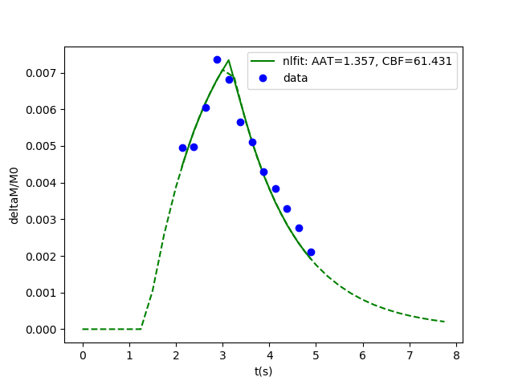
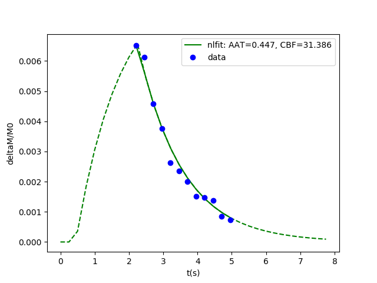

# Nonlinear fit for pCASL data


### Brief Description

Non-linear fitting of multi Post Label Delays (PLD) Pseudo-Continuous Arterial Spin Labeling (pCASL) MRI data using **SciPy**. Accepts command line arguments. Outputs to sys are perfusion ( mL/100 g tissue/min) and arrival time (s) for integration in bash script. Plots curve with raw data and fit. Requires a mask co-registered to the ASL image.

The fitting equations are based on the [general kinetic model for pCASL](https://doi.org/10.1002/mrm.27580)


### Requirements

Code runs on Python 3.6 In order to run the code the following libraries and MRI tools are required (which can be installed in a conda environment):
```
Requirements: 
Python 3, scipy , nibabel 
```

To run the analysis use the following command. Optional arguments: delta time for 2D EPI readout (eg. 30 ms), labeling duration (e.g. 1.8s), list of post-label delays (s)

```
python fit_ALS_data_multislice.py -m caudate.mask.nii.gz -i pCASL.calib.nii.gz
```


### Example of late arrival time in the occipital cortex



### Example of early arrival time in the caudate cortex



